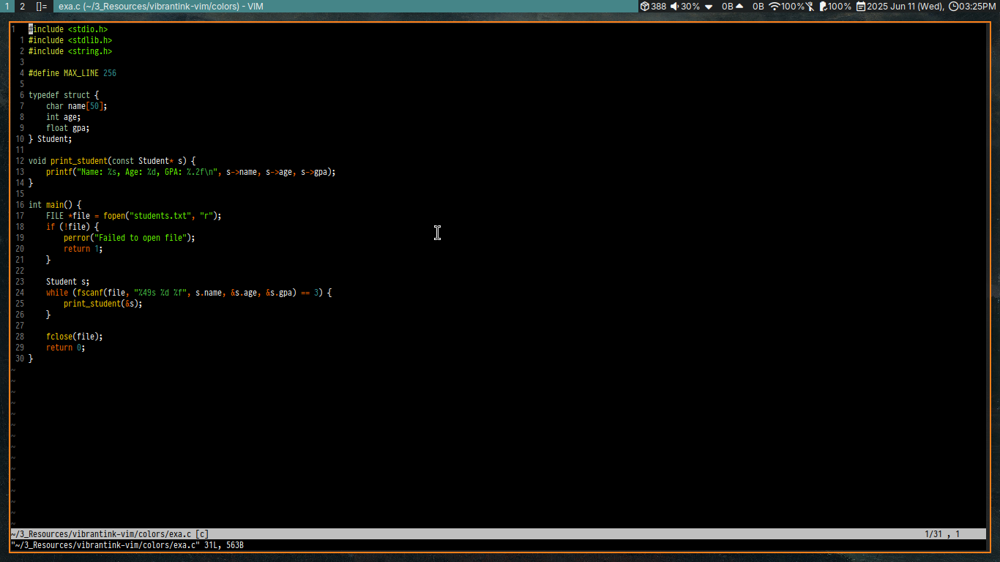
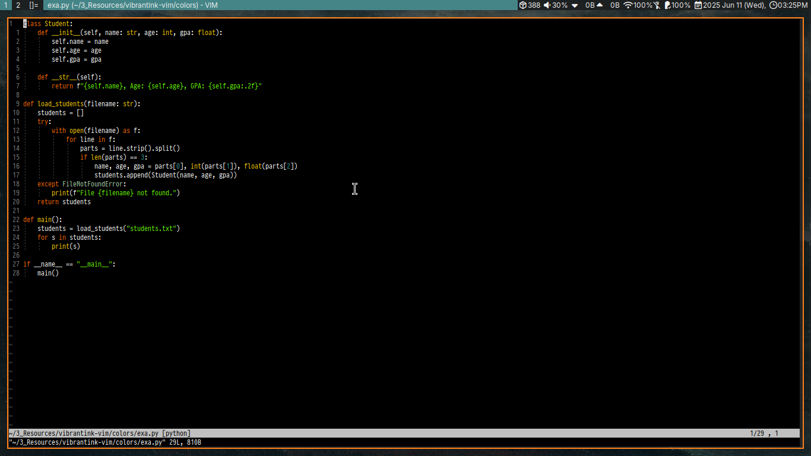
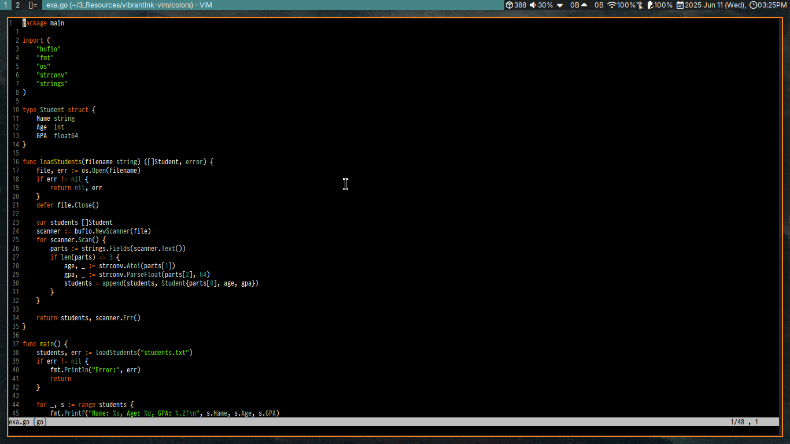

# 🎨 Vibrant Ink (256-Optimized)

A Vim colorscheme adapted from Justin Palmer’s [Vibrant Ink](http://www.iunknown.com/articles/2006/09/04/vim-can-save-your-hands-too), 
with enhanced 256-color terminal fidelity.

## ✨ Features

- Optimized for both GUI and 256-color terminals
- Dark background, high-contrast theme
- Inspired by the classic TextMate Vibrant Ink theme

## 📸 Preview

### C

### Python

### Go

